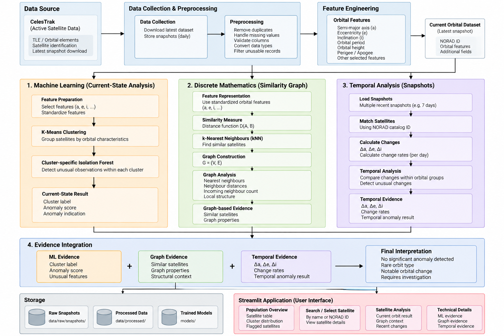

# System Architecture

## 1. Purpose

This document describes how the different parts of the project connect together.

The system combines:

- CelesTrak satellite data
- orbital feature engineering
- Machine Learning
- Discrete Mathematics and graph theory
- result integration
- Streamlit-based user interface

The architecture is designed so that each part has a clear responsibility.

---

## 2. Overall Architecture

The complete system can be represented as:



---

## 3. Data Source

The project uses active satellite orbital data from CelesTrak.

The main dataset contains orbital elements and satellite identification information.

Important fields include:

* `OBJECT_NAME`
* `OBJECT_ID`
* `EPOCH`
* `MEAN_MOTION`
* `ECCENTRICITY`
* `INCLINATION`
* `RA_OF_ASC_NODE`
* `ARG_OF_PERICENTER`
* `MEAN_ANOMALY`
* `NORAD_CAT_ID`
* `BSTAR`
* `MEAN_MOTION_DOT`
* `MEAN_MOTION_DDOT`

The initial Machine Learning and Discrete Mathematics analysis focuses mainly on:

* semi-major axis,
* eccentricity,
* inclination.

Other fields can be retained in the dataset for identification, additional analysis, or future extensions.

---

## 4. Data Collection Layer

The data collection layer obtains the latest active satellite data.

A simplified structure is:

```text
data/
└── raw/
    └── celestrak_data.csv
```

The raw data should not be modified after collection.

---

## 5. Preprocessing Layer

The preprocessing layer prepares the raw satellite data for analysis.

Typical operations include:

1. remove duplicate records,
2. handle missing values,
3. validate required columns,
4. convert data types where necessary,
5. remove records that cannot be used for analysis.

The goal is to create a consistent dataset for feature engineering.

---

## 6. Feature Engineering Layer

The raw orbital elements are transformed into useful physical features.

### Semi-Major Axis

Semi-major axis is derived from mean motion.

The orbital period is:

```text
T = 86400 / n
```

where:

* `T` = orbital period in seconds,
* `n` = mean motion in revolutions per day.

The semi-major axis can then be derived using the orbital relationship between period and orbital size.

The project uses the resulting semi-major axis as an important orbital feature.

---

### Other Derived Features

The feature-engineering layer can also calculate quantities such as:

* orbital height,
* orbital period,
* perigee,
* apogee,
* orbital speed.

Only features that are useful and appropriate for the final model should be retained.

---

## 7. Current Orbital Analysis

After feature engineering, the dataset becomes the main current-state dataset.

The current-state analysis answers:

> Is this satellite's current orbital state unusual compared with comparable satellites?

The pipeline is:

```text
Latest data
      ↓
Feature engineering
      ↓
Standardization
      ↓
K-Means
      ↓
Orbital groups
      ↓
Cluster-specific Isolation Forest
      ↓
Current-state anomaly result
```

---

## 8. K-Means Layer

K-Means groups satellites according to their selected orbital features.

For example:

```text
Satellite population
        ↓
      K-Means
        ↓
┌───────┬───────┬───────┬───────┬───────┐
│Group 1│Group 2│Group 3│Group 4│Group 5│
└───────┴───────┴───────┴───────┴───────┘
```

The purpose of the groups is to provide comparable orbital populations.

A satellite should generally be compared with satellites occupying similar orbital regimes rather than with every satellite in the dataset.

The cluster label is therefore used as context for the anomaly detector.

---

## 9. Isolation Forest Layer

Isolation Forest is used to detect unusual observations inside the orbital groups.

Instead of applying one anomaly detector blindly to the entire population, the system can analyze satellites within their respective orbital groups.

Conceptually:

```text
Cluster 1 → Isolation Forest
Cluster 2 → Isolation Forest
Cluster 3 → Isolation Forest
Cluster 4 → Isolation Forest
Cluster 5 → Isolation Forest
```

The output includes an anomaly indication and anomaly score.

The score is used as evidence rather than as a probability of danger.

---

## 10. Discrete Mathematics Layer

The Discrete Mathematics component represents relationships between satellites.

Each satellite becomes a vertex:

```text
V = {v1, v2, ..., vn}
```

A similarity rule determines whether two satellites should be connected.

The similarity is based on selected orbital features.

For example, using standardized orbital features:

```text
x = (a, e, i)
```

the distance between satellites A and B can be represented as:

```text
D(A,B) =
√[(aA - aB)² + (eA - eB)² + (iA - iB)²]
```

The standardized values are used in the actual comparison so that differences in feature scale do not dominate the distance.

---

## 11. Similarity Graph

The similarity relationships form a graph:

```text
G = (V, E)
```

where:

* `V` = satellites,
* `E` = orbital-similarity relationships.

The project uses a nearest-neighbour approach to construct the local similarity structure.

Conceptually:

```text
             Satellite B
                  |
                  |
Satellite A — Satellite C — Satellite D
                  |
             Satellite E
```

An edge means that the satellites are similar according to the selected orbital representation.

It does **not** mean that the satellites are physically close to each other in space.

---

## 12. Graph Analysis

The graph can provide structural information such as:

* nearest neighbours,
* neighbour distances,
* incoming neighbour count,
* local neighbourhood structure,
* connected components when an appropriate threshold representation is used.

These properties provide context for interpreting a satellite's position within the orbital population.

Graph information should not automatically be interpreted as an anomaly.

For example:

```text
Low neighbour count
        ≠
Automatically anomalous
```

It becomes useful when considered together with the satellite's orbital characteristics and Machine Learning result.

---

## 13. Evidence Integration

The final interpretation combines the two main sources:

```text
Current-state ML
       +
Graph context
       ↓
Integrated interpretation
```

The sources are complementary.

They should not be described as completely independent evidence because the Machine Learning and graph analysis use related orbital features.

The integration score ranges from 0 to 2, based on how many components indicate an anomaly.

Possible scores and interpretations include:

* **0: No significant anomaly detected.** Neither component flags the satellite.
* **1: Rare orbit type.** One component flags the satellite.
* **2: Requires investigation.** Both components flag the satellite as unusual.

These are system interpretations rather than proof of an actual fault or danger.

---

## 14. Application Layer

The final results are passed to the Streamlit application.

The application provides two levels of information.

### Simple View

Displays:

* satellite information,
* anomaly interpretation (score 0-2),
* main evidence.

### Technical View

Displays:

* orbital features,
* K-Means cluster,
* Isolation Forest result,
* similarity graph,
* graph properties.

This separation allows the system to remain understandable while still exposing the technical basis of its results.

---

## 15. Proposed Source Structure

The project code is organized according to responsibility.

```text
src/
│
├── data/
│   └── data collection and preprocessing
│
├── features/
│   └── orbital feature engineering
│
├── ml/
│   └── K-Means and Isolation Forest
│
├── dm/
│   └── similarity relationships and graph analysis
│
└── integration/
    └── combining ML and graph evidence
```

The user interface is separated from the analysis code:

```text
app/
└── app.py
```

This prevents the Streamlit interface from containing the core Machine Learning and mathematical logic.

---

## 16. Complete Data Flow

The complete architecture can therefore be summarized as:

```text
                    CelesTrak
                        ↓
                 Data Collection
                        ↓
                 Preprocessing
                        ↓
                Feature Engineering
                        ↓
              Current Orbital Dataset
                        ↓
                     K-Means
                        ↓
                 Orbital Groups
                        ↓
                Isolation Forest
                        ↓
                Current Anomaly
                        ↓
                Similarity Graph
                        ↓
                Evidence Integration
                        ↓
                 Final Interpretation
                        ↓
                  Streamlit App
```

---

## 17. Architecture Principle

Each component answers a different question:

| Component           | Main Question                                                 |
| ------------------- | ------------------------------------------------------------- |
| CelesTrak           | What orbital data is available?                               |
| Feature Engineering | What useful orbital quantities can be derived?                |
| K-Means             | Which satellites have comparable orbital characteristics?     |
| Isolation Forest    | Which observations are unusual within those groups?           |
| Similarity Graph    | How is each satellite related to nearby orbital observations? |
| Integration         | What does the combined evidence indicate?                     |
| Streamlit           | How can the user investigate the result?                      |

The architecture is therefore based on a simple principle:

**Current orbital state + orbital relationships → explainable anomaly analysis**
