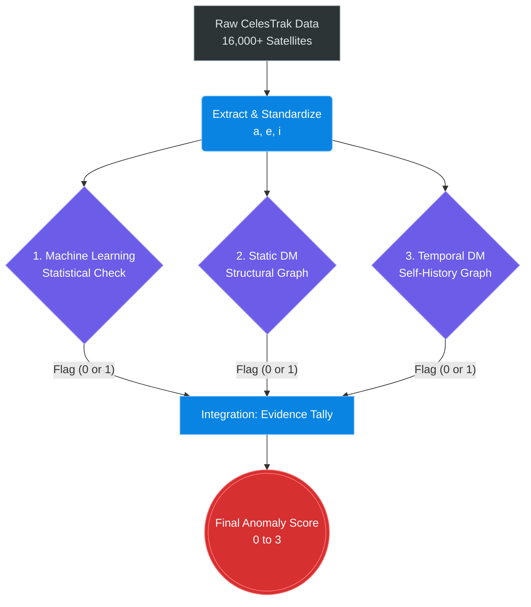

# Project Review: Satellite Anomaly Detection Using Machine Learning and Discrete Mathematics

## 1. Project Goal and The Problem Space

As Low Earth Orbit (LEO) becomes increasingly crowded with mega-constellations, dead payloads, and debris, space situational awareness is critical. Traditional tracking systems rely purely on physics: they project a satellite's path and calculate if it will collide with something.

However, physical collision prediction is not anomaly detection. If a satellite suffers a hardware failure and starts tumbling into a strange orbit, or if an experimental satellite executes an unannounced thruster burn, standard collision systems struggle to simply ask: *"Is this satellite behaving normally?"*

Our project aims to solve this by building a triage system. We filter the 16,000+ objects in orbit down to the absolute most interesting anomalies by evaluating them structurally, statistically, and behaviorally.

### The Core Features
We don't track X, Y, Z spatial coordinates. We track the **shape** of the orbit using three classical elements:
1.  **Semi-major axis ($a$):** The size/average altitude of the orbit.
2.  **Eccentricity ($e$):** How circular or oval-shaped the orbit is.
3.  **Inclination ($i$):** The tilt of the orbit relative to the equator.

**Crucial Step - Standardization:** Because altitude is measured in thousands of kilometers and eccentricity is a decimal between 0 and 1, we cannot do math on them directly. We use z-scores to standardize these features into a common scale ($std\_a$, $std\_e$, $std\_i$).

---

## 2. The Overall Workflow

The pipeline runs on daily data snapshots from CelesTrak. Every satellite passes through three independent mathematical checks.

---

## 3. Component 1: Machine Learning (The Statistical Check)

The first component relies on statistical density to find satellites that do not fit in with their peers.

*   **Step 1: K-Means Clustering:** We cannot compare a high-altitude weather satellite to a low-altitude Starlink. K-Means clustering divides the catalog into distinct orbital families based on their features.
*   **Step 2: Isolation Forest:** Within each specific family, we run an Isolation Forest algorithm. This builds random decision trees to partition the data. If a satellite is sitting in a sparse, low-density region of the cluster, it requires very few tree splits to isolate it.
*   **The Result:** If the algorithm isolates the satellite easily, it receives the ML Anomaly Flag ($F_{ML} = 1$). 

---

## 4. Component 2: The Orbital Similarity Graph (Static DM)

While the ML check looks at density, the second check uses **Discrete Mathematics** to map the exact structural relationships between satellites. We build a massive mathematical graph representing the "social network" of orbits.

### DM Concepts Used:
*   **Directed Graph (Digraph):** A graph $G = (V, E)$ where edges have a one-way direction. 
*   **Node In-Degree:** The number of edges pointing *at* a node ($\text{deg}^-(v)$).

### The Implementation & Math:
1.  **Nodes ($V$):** Every satellite in the catalog is a node.
2.  **Distance Metric:** We calculate the 3-dimensional Euclidean distance between the standardized features of Satellite 1 and Satellite 2:
    $$ D = \sqrt{(std\_a_1 - std\_a_2)^2 + (std\_e_1 - std\_e_2)^2 + (std\_i_1 - std\_i_2)^2} $$
3.  **Edges ($E$):** We construct a directed k-Nearest Neighbor (k-NN) graph. Every satellite draws a directed edge to the 5 nodes with the smallest distance $D$. Because it is a digraph, relationships are asymmetric (A points to B, but B might point to C).
4.  **The Flagging Rule:** We flag a satellite $v$ if it satisfies **both** of these structural conditions:
    *   Condition 1: **$\text{deg}^-(v) = 0$** (Nobody points to this satellite).
    *   Condition 2: **$\text{mean\_dist}(v) > \mu_{\text{global\_dist}}$** (The 5 satellites it points to are actually very far away, mathematically speaking).

*Why both conditions?* If we only looked for an In-Degree of 0, we might accidentally flag normal satellites sitting perfectly on the edge of a dense Starlink cluster. The second condition guarantees the satellite is a true "structural loner"—ignored by everyone, and far away from its own closest neighbors.

---

## 5. Component 3: Temporal Analysis (The Behavioral Check)

Components 1 and 2 evaluate a single snapshot in time. Component 3 evaluates a satellite's behavior over a 7-day window. It completely ignores the rest of the catalog and compares the satellite exclusively to its own past.

### DM Concepts Used:
*   **Tolerance Relation ($\sim$):** A binary relation that connects two elements if they are mathematically similar. It is reflexive ($x \sim x$) and symmetric ($x \sim y \implies y \sim x$), but not transitive.
*   **Node Degree:** The total number of edges connected to a node in an undirected graph.

### The Implementation & Math:
1.  **Nodes:** We track the daily changes (transitions) for a single satellite over a week. Each daily transition vector $T$ is a Node.
    $$ T_k = [ \Delta a, \Delta e, \Delta i ] $$
2.  **The Relation:** We take today's transition ($T_{\text{latest}}$) and compare it against all historical transitions ($T_k$). We define them as related (we draw an undirected edge between them) if their Euclidean distance is less than a strict similarity threshold $\epsilon$:
    $$ T_{\text{latest}} \sim T_k \iff \text{Distance}(T_{\text{latest}}, T_k) \le \epsilon $$
3.  **The Flagging Rule:** We evaluate the **Node Degree** of today's transition, denoted as $\text{deg}(T_{\text{latest}})$, which is the count of how many past days were mathematically similar to today. We flag today's movement if:
    $$ \text{deg}(T_{\text{latest}}) \le 1 $$
    
*What this means:* If the degree is $\le 1$, today's orbital shift does not connect to the satellite's established history. The satellite just shifted its orbit in a completely unprecedented way, triggering the behavioral alarm.

---

## 6. Integration: The Final Evidence Tally

We integrate the three pipelines using a simple tally system:
$$ \text{Final Score} = F_{\text{ML}} + F_{\text{DM}} + F_{\text{Temp}} $$

*   **Score 0:** Nominal behavior.
*   **Score 1:** Low Warning. A single mathematical lens detected a discrepancy.
*   **Score 2:** High Warning. Two independent mathematical checks agree.
*   **Score 3:** Critical Anomaly. Unanimous consensus. The satellite is statistically unusual, structurally isolated in the graph, and actively changing its orbit.

By cross-verifying density (ML), topology (Static DM), and history (Temporal DM), we drastically reduce false positives. A perfectly normal satellite will not accidentally trigger all three completely different equations simultaneously.
