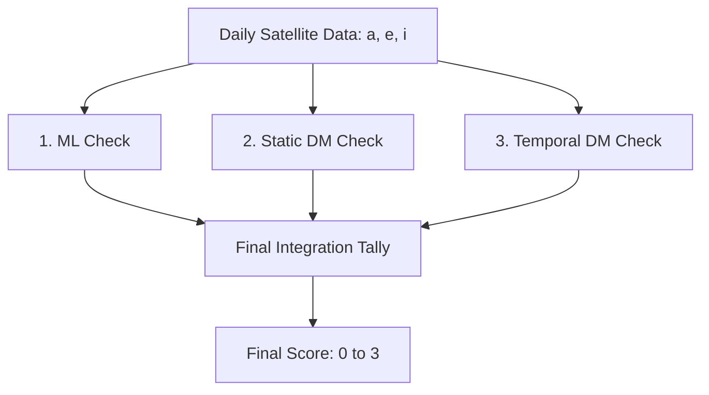

# Project Review: Satellite Anomaly Detection Using Machine Learning and Discrete Mathematics

## 1. The Problem We Are Solving

Space is becoming crowded. Traditional tracking systems are mostly focused on predicting direct physical collisions. But this misses a bigger picture: we also need a way to find satellites that are just behaving strangely. 

In this project, an **anomaly** simply means a satellite that is doing something unexpected. This could be a dead satellite tumbling into a strange orbit, a satellite firing a thruster without warning, or an experimental spacecraft flying a highly unusual path.

### The 3 Core Parameters
We track these anomalies by looking at three classic orbital elements:
1.  **Semi-major axis ($a$):** The overall size of the orbit.
2.  **Eccentricity ($e$):** How stretched out or oval-shaped the orbit is.
3.  **Inclination ($i$):** The tilt of the orbit compared to the Earth's equator.

By measuring these three numbers, we know exactly what shape a satellite's orbit is at any given moment.

---

## 2. The Overall Workflow

Our system pulls satellite data twice a day. To make sure we don't accidentally flag normal satellites (false alarms), we evaluate every single satellite using three separate checks: Machine Learning, a Static Discrete Math Graph, and a Temporal History Graph.

At the end, we simply add the flags together. A score of 3 means the satellite failed all three mathematical checks, guaranteeing it requires human attention.

---

## 3. Component 1: Machine Learning (The Statistical Check)

The first check looks at standard statistics. 

*   **What it does:** It separates the crowded Low Earth Orbit space into natural families (like polar orbits or specific satellite constellations) using K-Means clustering. Then, it uses a tool called Isolation Forest to find the satellites sitting on the fringes of those families.
*   **The simple explanation:** If a satellite is sitting far away from the rest of its normal group, the ML model flags it as an outlier. 

---

## 4. Component 2: The Orbital Similarity Graph (Static DM)

While the ML check looks at general groups, the second check uses **Discrete Mathematics** to look at the exact structure of how satellites relate to each other.

### DM Concepts Used:
*   **Directed Graph (Digraph):** A network where connections are one-way arrows. 
*   **Node In-Degree:** The number of arrows pointing *at* a specific item in the network.

### How we implemented it:
1.  We treat every satellite as a Node in a graph.
2.  We force every satellite to draw an arrow pointing to the 5 other satellites that have the most similar orbit shape (using Euclidean distance). 
3.  Because it is a Directed Graph, the arrows are one-way. Satellite A might point at Satellite B, but B might point at someone else.
4.  **The Rule:** We flag any satellite that has an **In-Degree of 0**. This means that out of all the thousands of satellites in space, zero satellites pointed an arrow back at this one. It proves the satellite is a structural loner.

---

## 5. Component 3: Temporal Analysis (The Behavioral Check)

The first two components look at a single day. The third component looks at how a satellite changes over a 7-day period.

### DM Concepts Used:
*   **Tolerance Relation:** A mathematical rule that connects two things if they are "similar enough". It means a day is perfectly similar to itself, and if Monday is similar to Tuesday, then Tuesday is similar to Monday.
*   **Node Degree:** The total number of connections an item has.

### How we implemented it:
1.  We record how much a satellite moves every single day (the changes in $a, e,$ and $i$). We treat each day's movement as a Node.
2.  We take today's movement and compare it to the satellite's past movements over the week.
3.  We apply our **Tolerance Relation**: if today's math is close to a past day's math (distance $\le$ threshold), we draw an edge connecting them.
4.  **The Rule:** We check the **Node Degree** of today's movement. If the degree is $0$ or $1$, it means today's movement does not connect to the satellite's normal history. The satellite just did something totally new, so we flag it.

---

## 6. Integration and Conclusion

By keeping the three checks independent, the pipeline is very robust. If we just used Machine Learning, a satellite shifting normally might accidentally trigger an alarm. But by using Discrete Mathematics to cross-verify the actual graph structure and historical behavior, we prove mathematically whether an orbit is truly anomalous. 
