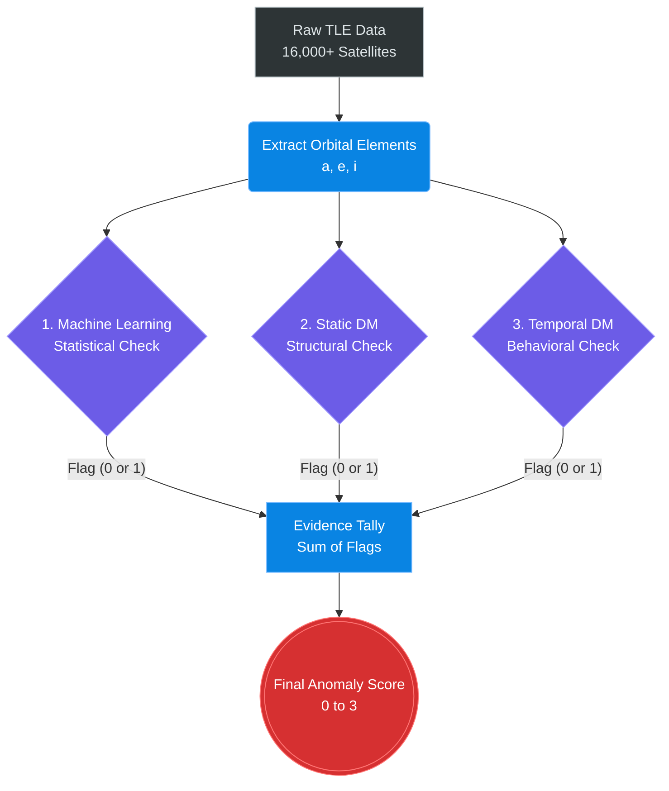

# Project Review: Satellite Anomaly Detection Using Machine Learning and Discrete Mathematics

## 1. The Problem We Are Solving

Space is becoming crowded, especially in Low Earth Orbit (LEO) with mega-constellations like Starlink. Right now, traditional tracking systems rely purely on physics—they project where a satellite *should* be and check if it will hit anything. 

But physical collisions are only part of the problem. What if a satellite breaks down and starts tumbling into a strange orbit? What if a military satellite quietly fires its thrusters to change its path? Standard collision systems struggle to answer: *"Is this satellite behaving normally?"*

In this project, an **anomaly** means a satellite that is statistically, structurally, or behaviorally doing something unexpected.

### The 3 Core Orbital Parameters
Instead of looking at X, Y, Z coordinates (which change every second as satellites fly around the Earth), we look at the shape of the orbit itself. We use three classic orbital elements:
1.  **Semi-major axis ($a$):** This dictates the size of the orbit (essentially the average altitude).
2.  **Eccentricity ($e$):** This dictates how circular or stretched-out (oval) the orbit is.
3.  **Inclination ($i$):** This dictates the tilt of the orbit. (e.g., 0 degrees orbits the equator, 90 degrees flies over the poles).

By looking at $a$, $e$, and $i$, we can identify exactly what kind of mission a satellite is flying.

---

## 2. The Overall Workflow

Our system pulls the latest catalog of all 16,000+ tracked objects twice a day. To make sure we don't accidentally flag normal satellites (false alarms), we evaluate every single satellite using three completely independent mathematical checks.

---

## 3. Component 1: Machine Learning (The Statistical Check)

The first check uses statistics to find satellites that don't fit in with their peers.

*   **The Grouping (K-Means):** You can't compare a high-altitude weather satellite to a low-altitude Starlink. So, we first use a K-Means clustering algorithm to group the catalog into natural families based on $a, e,$ and $i$.
*   **The Outlier Detection (Isolation Forest):** Once the satellites are in their families, we use an algorithm called Isolation Forest. It tries to draw random lines (mathematical boundaries) to separate the data. If a satellite is sitting far away from the rest of its group, it requires very few lines to isolate it. 
*   **The Result:** The model flags the satellite (Flag = 1) if it is statistically separated from its natural family. 

---

## 4. Component 2: The Orbital Similarity Graph (Static DM)

While the ML check looks at general statistics, the second check uses **Discrete Mathematics** to look at the exact structure of the satellite catalog. We build a massive mathematical graph of 16,000 nodes.

### DM Concepts Used:
*   **Directed Graph (Digraph):** A network where connections are one-way arrows. 
*   **Node In-Degree:** The number of arrows pointing *at* a specific item in the network.

### How we implemented it:
1.  **Building the Network:** We treat every satellite as a Node. We force every satellite to draw a directed arrow pointing to the 5 other satellites that have the most identical orbit shape (using Euclidean distance).
2.  **Asymmetric Relations:** Because it is a Directed Graph, the arrows are one-way. Satellite A might point at Satellite B, but Satellite B is allowed to point at someone else.
3.  **The Flagging Rule:** We flag any satellite that has an **In-Degree of 0**. 
    *   *What does this mean?* It means that out of all 16,000 satellites in space, zero satellites pointed an arrow back at this one. It mathematically proves the satellite is a structural loner with a highly unusual orbit.

---

## 5. Component 3: Temporal Analysis (The Behavioral Check)

The first two components look at a snapshot of a single day. The third component evaluates how a satellite's behavior changes over time. It compares a satellite exclusively to its own past.

### DM Concepts Used:
*   **Tolerance Relation:** A mathematical rule that connects two things if they are "similar enough." In Discrete Math, a tolerance relation is reflexive (a thing is perfectly similar to itself) and symmetric (if A is similar to B, B is similar to A), but it is not transitive.
*   **Node Degree:** The total number of connections an item has in an undirected graph.

### How we implemented it:
1.  **Tracking Daily Changes:** Over a 7-day window, we record how much a satellite moves every single day (e.g., the change in altitude between Monday and Tuesday). We treat each day's mathematical movement as a Node.
2.  **Applying the Relation:** We take *today's* movement and compare it to the satellite's past movements over the week. If today's math is close to a past day's math (the Euclidean distance is $\le$ threshold), the Tolerance Relation is satisfied, and we draw an edge connecting them.
3.  **The Flagging Rule:** We check the **Node Degree** of today's movement. If the degree is $0$ or $1$, it means today's movement does not connect to the satellite's normal history. The satellite just shifted its orbit in a way it hasn't done all week, so we flag it.

---

## 6. Integration: The Final Tally

Because anomaly detection algorithms can sometimes make mistakes and trigger false alarms, we never rely on just one component. We integrate them using a simple Evidence Tally:

$$ \text{Final Score} = F_{\text{ML}} + F_{\text{DM}} + F_{\text{Temp}} $$

*   **Score 0:** Nominal. (Normal behavior).
*   **Score 1:** Low Warning. (One math check found something slightly off).
*   **Score 2:** High Warning. (Two completely different math checks agree something is wrong).
*   **Score 3:** Critical Anomaly. (Unanimous consensus. The satellite is statistically unusual, structurally isolated, and actively changing its orbit).

By cross-verifying statistical density (ML) against actual graph structure (Static DM) and historical behavior (Temporal DM), we can filter 16,000 objects down to the absolute most interesting anomalies in orbit.
