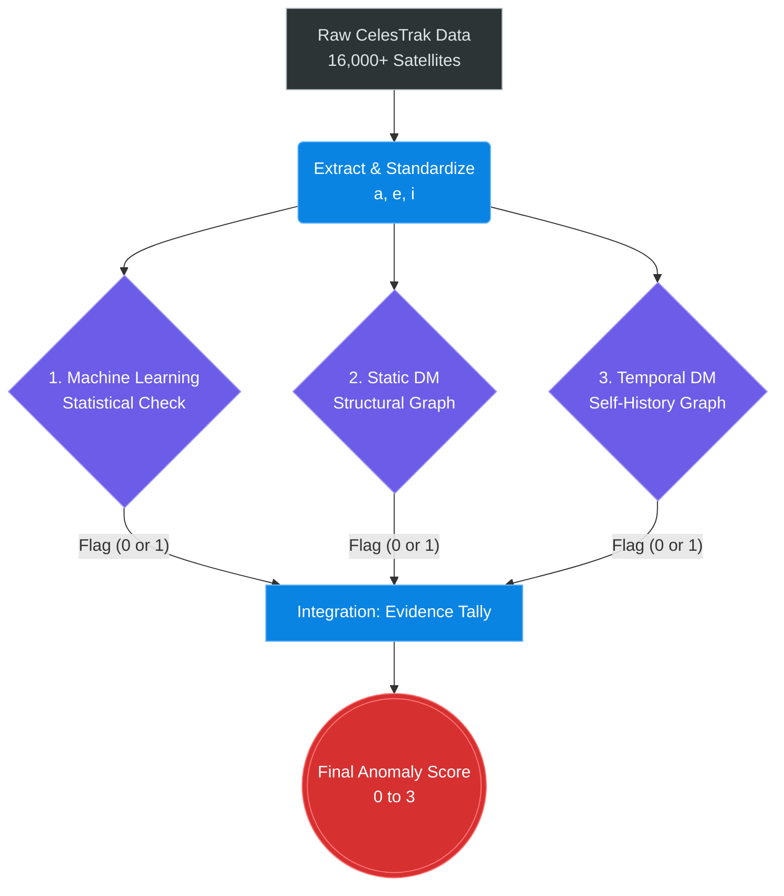

# Project Review: Satellite Anomaly Detection Using Machine Learning and Discrete Mathematics

## 1. The Problem Space (Why we are doing this)

Low Earth Orbit (LEO) is getting dangerously crowded. If we aren't careful, we risk triggering **Kessler Syndrome**—a theoretical scenario where a single collision creates a cloud of debris, which hits other satellites, creating an unstoppable cascade of destruction that could make space completely unusable.

Right now, standard systems try to prevent this by using physics to predict direct collisions. But that's not enough. We want to catch satellites *before* they become a collision risk. We need to find **anomalies**. 

To us, an "anomaly" simply means a satellite that is behaving weirdly. Maybe a dead satellite is tumbling into a strange orbit, or a military satellite is quietly firing thrusters to change its path.

### The 3 Core Features
We don't track X, Y, Z spatial coordinates. We track the **shape** of the orbit using three classical elements:
1.  **Semi-major axis ($a$):** The size/average altitude of the orbit.
2.  **Eccentricity ($e$):** How circular or oval-shaped the orbit is.
3.  **Inclination ($i$):** The tilt of the orbit relative to the equator.

**Crucial Step - Standardization:** Because altitude is measured in thousands of kilometers and eccentricity is a tiny decimal, we cannot do math on them directly. We use z-scores to standardize these features into a common scale ($std\_a$, $std\_e$, $std\_i$).

---

## 2. The Overall Workflow

The pipeline runs on daily data snapshots from CelesTrak. Every satellite passes through three independent mathematical checks.

---

## 3. Component 1: Machine Learning (The Statistical Check)

This component uses statistical density to find satellites that do not fit in with their peers.

*   **Step 1 (K-Means Clustering):** We cannot compare a high-altitude weather satellite to a low-altitude Starlink. K-Means divides the entire catalog into distinct orbital families based on their features.
*   **Step 2 (Isolation Forest):** Within each specific family, we run an Isolation Forest algorithm. If a satellite is sitting in a sparse, empty region on the edge of the cluster, the algorithm easily isolates it.
*   **The Result:** If the algorithm isolates the satellite easily, it outputs an anomaly flag of `1`. Otherwise, `0`. 

---

## 4. Component 2: The Orbital Similarity Graph (Static DM)

This component uses Discrete Mathematics to map the exact structural relationships between satellites. We build a massive mathematical graph representing the "social network" of orbits.

### DM Concepts & How We Use Them:
*   **Sets & Elements:** In DM, a Set ($S$) is a collection of objects. Here, our universal set is the catalog of 16,000 satellites. Each individual satellite is an element ($x \in S$).
*   **Binary Relations:** A relation defines how elements in a set connect to each other. We define a relationship based on mathematical distance. 
*   **Directed Graph (Digraph):** We visually map this relation as a Digraph $G = (V, E)$, where the satellites are the Vertices ($V$). We calculate the Euclidean distance between every satellite's features. Then, every satellite draws a one-way directed Edge ($E$) to the 5 other satellites that have the most identical orbit shape.

### The Flagging Rule (Producing the Score):
We evaluate two specific graph properties for a satellite $v$:
1.  **Node In-Degree ($\text{deg}^-(v)$):** The number of incoming arrows pointing *at* the satellite.
2.  **Mean Outward Distance ($\text{mean\_dist}(v)$):** The average length of the 5 arrows the satellite points outward.

The logic outputs a `1` (Anomaly) **only if both** conditions are met:
$$ \text{deg}^-(v) = 0 \quad \textbf{AND} \quad \text{mean\_dist}(v) > \mu_{\text{global\_dist}} $$

*Why both?* If we only looked for an In-Degree of 0, we might accidentally flag perfectly normal satellites that are just sitting on the outer edge of a massive Starlink cluster (Starlinks only point at the center of the cluster, ignoring the edge). By adding the second condition, we mathematically prove the satellite is a true "structural loner"—nobody points at it, AND it is extremely far away from its own closest neighbors.

---

## 5. Component 3: Temporal Analysis (The Behavioral Check)

Components 1 and 2 evaluate a single snapshot in time. Component 3 evaluates a satellite's behavior over a 7-day window. It completely ignores the rest of the catalog and compares the satellite exclusively to its own past.

### DM Concepts & How We Use Them:
*   **Sets & Elements:** Here, the set is NOT the satellites. The set is the 7-day history of a *single* satellite. The elements are the daily changes in its orbit, which we call transitions ($T_k = [\Delta a, \Delta e, \Delta i]$).
*   **Tolerance Relation ($\sim$):** We define a relation to connect two days if their orbital changes were mathematically similar (distance $\le \epsilon$). In DM, this is called a Tolerance Relation because it is **reflexive** (a day is perfectly similar to itself) and **symmetric** (if Monday is similar to Tuesday, Tuesday is similar to Monday).
*   **Undirected Graph:** Because the relation is symmetric, we build an undirected graph connecting the days where the satellite behaved similarly.

### The Flagging Rule (Producing the Score):
We look at today's transition ($T_{\text{latest}}$). We want to know how many past days it is connected to. In DM, this count is the **Node Degree**, denoted as $\text{deg}(T_{\text{latest}})$.

The logic outputs a `1` (Anomaly) if:
$$ \text{deg}(T_{\text{latest}}) \le 1 $$

*What this means:* If the degree is 0 or 1, today's orbital shift has almost zero connection to the satellite's established history. The satellite just shifted its orbit in a completely unprecedented way, triggering the behavioral alarm.

---

## 6. Integration: The Final Evidence Tally

We integrate the three pipelines using a simple tally system:
$$ \text{Final Score} = F_{\text{ML}} + F_{\text{DM}} + F_{\text{Temp}} $$

*   **Score 0:** Nominal behavior.
*   **Score 1:** Low Warning. A single mathematical lens detected a discrepancy.
*   **Score 2:** High Warning. Two independent mathematical checks agree.
*   **Score 3:** Critical Anomaly. Unanimous consensus. The satellite is statistically unusual, structurally isolated in the graph, and actively changing its orbit.

By cross-verifying density (ML), topology (Static DM), and history (Temporal DM), we drastically reduce false positives. A perfectly normal satellite will not accidentally trigger all three completely different equations simultaneously.
